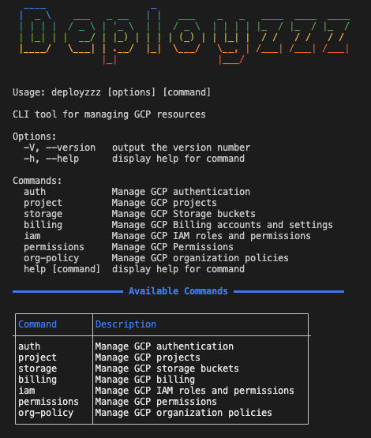
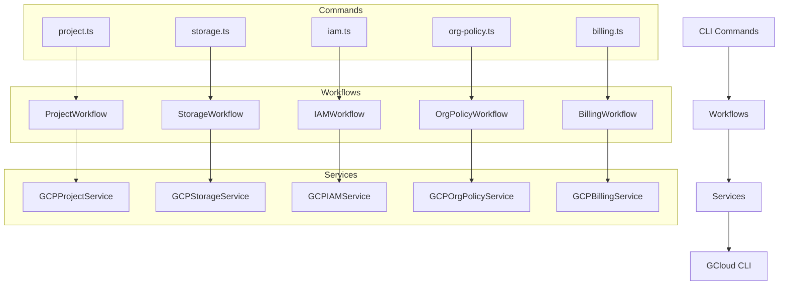

# Deployzzz 🚀

A powerful CLI tool for managing Google Cloud Platform (GCP) resources with an interactive and developer-friendly interface.



```
CLI tool for managing GCP resources

Usage: deployzzz [options] [command]

Options:
  -v, --version     output the version number
  -h, --help        display help for command

Commands:
  auth             Manage GCP authentication
  project          Manage GCP projects
  storage          Manage GCP Storage buckets
  billing          Manage GCP Billing accounts and settings
  iam              Manage GCP IAM roles and permissions
  permissions      Manage GCP Permissions
  org-policy       Manage GCP organization policies
  help [command]   display help for command
```

## 🌟 Features

### Authentication & Project Management
- 🔐 Interactive GCP authentication
- 📋 List and manage GCP projects
- 🆕 Create new projects with validation
- 🔍 Get detailed project information
- 🗑️ Safely delete projects with confirmation

### Storage Management
- 📦 Create and manage GCP Storage buckets
- 🌍 Predefined regions and storage classes
- 🔒 Configure bucket access (public/private)
- 📋 List all buckets in a project
- 🔍 Check bucket public status

### IAM & Permissions
- 👥 Manage user roles and permissions
- 🔑 Add/remove specific roles
- 👑 Apply admin roles with confirmation
- 📋 List user roles
- 🔍 Check user permissions

### Organization Policies
- 📜 List organization policies
- 🔍 Get detailed policy information
- ⚡ Set policy enforcement status
- ➕ Add policy exceptions
- 🔒 Manage policy restrictions

### Billing Management
- 💳 List billing accounts
- 🔗 Link billing accounts to projects
- 🔍 Check billing status
- 💰 Manage billing configurations

## 🛠️ Prerequisites

- Node.js >= 16.0.0
- Google Cloud SDK installed
- A Google Cloud account with appropriate permissions
- npm or yarn package manager

## 📦 Installation

```bash
# Install globally
npm install -g deployzzz

# Or install locally in your project
npm install deployzzz --save-dev
```

## 🚀 Usage

### Authentication
```bash
# Interactive authentication
deployzzz auth

# Authenticate with specific project
deployzzz auth --project-id my-project
```

### Project Management
```bash
# List all projects
deployzzz project list

# Create new project (interactive)
deployzzz project create

# Get project details
deployzzz project info

# Delete project (with confirmation)
deployzzz project delete
```

### Storage Management
```bash
# List buckets
deployzzz storage list

# Create new bucket (interactive)
deployzzz storage create-bucket

# Make bucket public/private
deployzzz storage make-public
deployzzz storage make-private

# Check bucket status
deployzzz storage check-public
```

### IAM Management
```bash
# List user roles
deployzzz iam list-roles

# Add role to user
deployzzz iam add-role

# Remove role from user
deployzzz iam remove-role

# Apply admin roles
deployzzz iam apply-admin
```

### Organization Policies
```bash
# List policies
deployzzz org-policy list

# Get policy details
deployzzz org-policy get

# Set policy enforcement
deployzzz org-policy set-enforcement

# Add policy exception
deployzzz org-policy add-exception
```

### Billing Management
```bash
# List billing accounts
deployzzz billing list-accounts

# Link billing account
deployzzz billing link

# Check billing status
deployzzz billing check
```

## 🏗️ Architecture



## 🛠️ Development

```bash
# Clone the repository
git clone https://github.com/yourusername/deployzzz.git
cd deployzzz

# Install dependencies
npm install

# Build the project
npm run build

# Link locally
npm link

# Run tests
npm test
npm run test:watch
npm run test:coverage

# Lint code
npm run lint
npm run lint:fix

# Format code
npm run format
```

## 📝 Available Scripts

- `npm run build` - Build the project
- `npm run build:watch` - Watch mode for development
- `npm run clean` - Clean build directory
- `npm run dev` - Run in development mode
- `npm test` - Run tests
- `npm run lint` - Run linter
- `npm run format` - Format code
- `npm run permissions` - Set execution permissions
- `npm link` - Link package globally
- `npm unlink` - Unlink package

## 🔒 Security

- All sensitive operations require confirmation
- Interactive mode for safer execution
- Proper error handling and logging
- No hardcoded credentials
- Secure project deletion with confirmation

## 🤝 Contributing

1. Fork the repository
2. Create your feature branch (`git checkout -b feature/amazing-feature`)
3. Commit your changes (`git commit -m 'Add some amazing feature'`)
4. Push to the branch (`git push origin feature/amazing-feature`)
5. Open a Pull Request

## 📄 License

This project is licensed under the ISC License - see the [LICENSE](LICENSE) file for details.

## 🙏 Acknowledgments

- [Google Cloud Platform](https://cloud.google.com/)
- [Commander.js](https://github.com/tj/commander.js)
- [Inquirer.js](https://github.com/SBoudrias/Inquirer.js)
- [TypeScript](https://www.typescriptlang.org/)

## 📞 Support

For support, please open an issue in the GitHub repository or contact the maintainers.

## 🔄 Updates

Stay tuned for updates and new features! Follow the repository for the latest changes. 